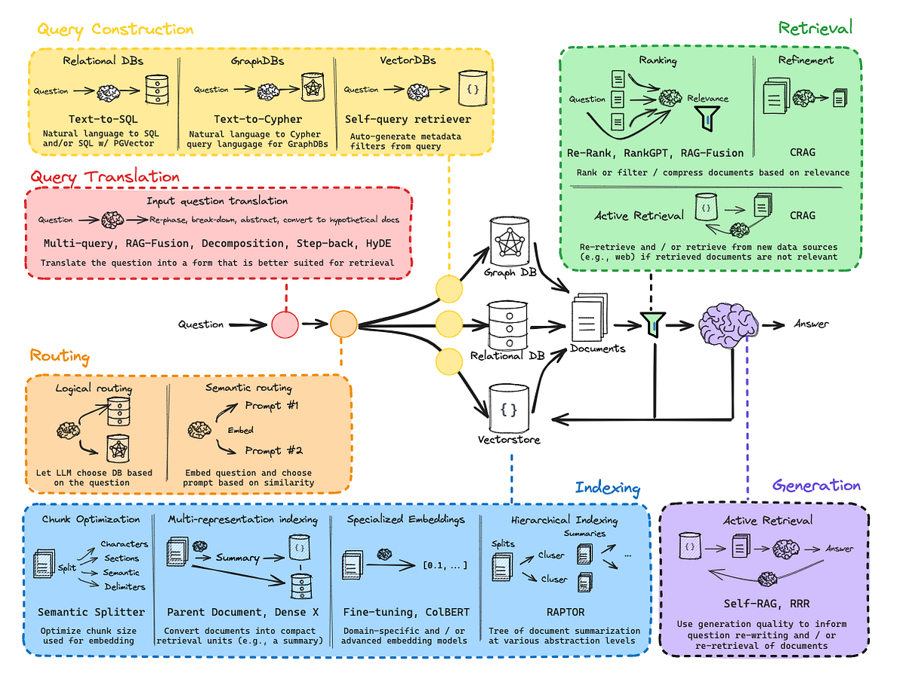
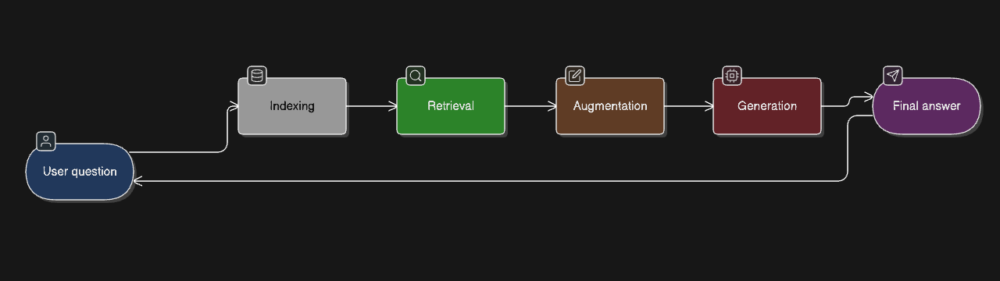
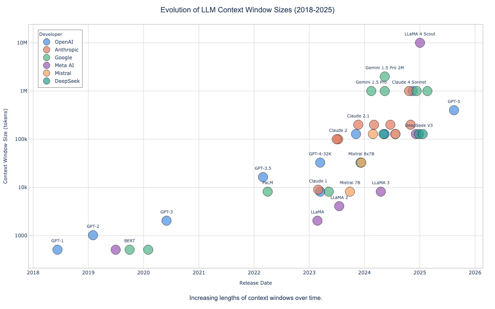

# Module 01 — Introduction to RAG

Why retrieval-augmented generation exists and the four stages of a RAG pipeline, from a from-scratch index to a working LangChain baseline.

| # | Notebook | You will learn |
|---|---|---|
| 01 | [01_indexing_from_scratch.ipynb](notebooks/01_indexing_from_scratch.ipynb) | Build a tiny TF-IDF + nearest-neighbour index to see what 'indexing' means before any framework |
| 02 | [02_retrieval_strategies.ipynb](notebooks/02_retrieval_strategies.ipynb) | Retrieve by embedding similarity with a nearest-neighbour index over OpenAI embeddings |
| 03 | [03_langchain_rag_quickstart.ipynb](notebooks/03_langchain_rag_quickstart.ipynb) | Embed documents and store/search them with LangChain + Chroma instead of by hand |
| 04 | [04_rag_lifecycle_and_baseline.ipynb](notebooks/04_rag_lifecycle_and_baseline.ipynb) | Walk the full RAG lifecycle (load, split, embed, store, retrieve, generate) and build a measured baseline pipeline |

## Before you run

- `02_retrieval_strategies.ipynb` reads an OpenAI key from an `apikeys.yml` file through the
  local `utils.py` (`openai: {api_key: ...}`); create that file beside the notebook, or set the key
  yourself in the cell. `apikeys.yml` is git-ignored.
- `04_rag_lifecycle_and_baseline.ipynb` is the canonical lesson. It uses
  `helpers.get_experientiallabs_llm()` (needs `EXPERIENTIALLABS_API_KEY`) plus `OPENAI_API_KEY`
  for embeddings, and finds its data through `src/rag_paths.py`.

## Overview diagrams

## Sources

Extracted from the `AI-ENGINEERING-DEMYSTIFIED` monorepo (tag `pre-multirepo-split-2026-09`). Every notebook's original path is listed in [docs/content-inventory.csv](../../docs/content-inventory.csv).
